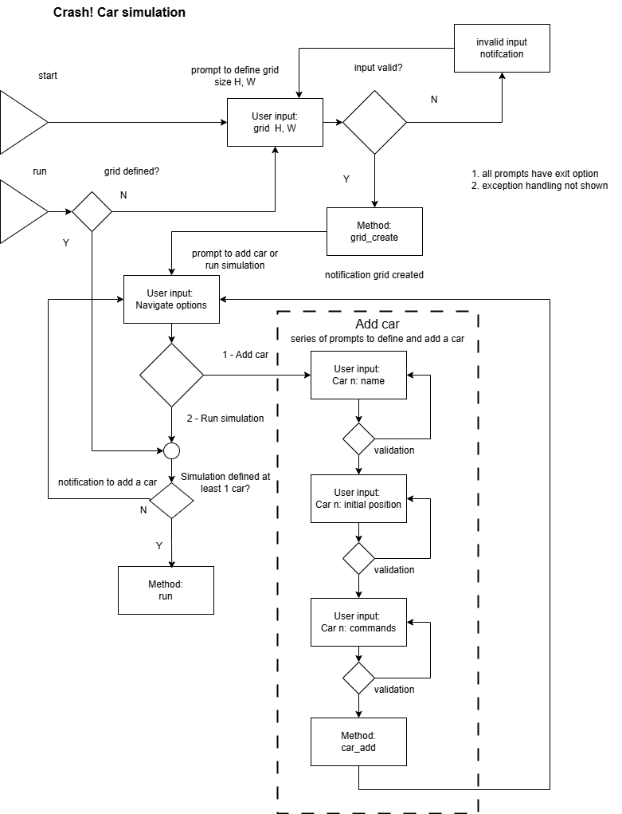

# Auto Driving Car Simulation

## Crash: About program

The simulation program is designed to work with a rectangular field, specified by its width and height. The bottom left coordinate of the field is at position (0,0), and the top right position is denoted (width,height). For example, a field with dimensions 10 x 10 would have its upper right coordinate at position (9,9).

One or more cars can be added to the field, each with a unique name, starting position, and direction they are facing. For instance, a car named "A" may be placed at position (1,2) and facing North.

A list of commands can be issued to each car, which can be one of three commands:

- L: rotates the car by 90 degrees to the left
- R: rotates the car by 90 degrees to the right
- F: moves forward by 1 grid point

If a car tries to move beyond the boundary of the field, the command is ignored, and the car stays in its current position. For example, if a car at position (0,0) is facing South and receives an F command, the command will be ignored as it would take the car beyond the boundary of the field.

## Setup simulation

_01 simulation setup_

```
Welcome to Auto Driving Car Simulation!

Please enter the width and height of the simulation field in x y format:
```

_02 exit_

```
Thank you for running the simulation. Goodbye!
```

_03 adding cars_


```
You have created a field of 10 x 10.

Please choose from the following options:
[1] Add a car to field
[2] Run simulation
```

_03.01 add car step 01 name a car_

```
Please enter the name of the car:
```

_03.02 add car step 02 initial pos and dir_

```
Please enter initial position of car A in x y Direction format:
```

_03.03 add car step 02 car commands_

```
Please enter the commands for car A:
```

only N, S, W, E (representing North, South, West, East) are allowed for direction.


```
Your current list of cars are:
- A, (1,2) N, FFRFFFFRRL

Please choose from the following options:
[1] Add a car to field
[2] Run simulation
```

## Run simulation

Then the system will run all car A's commands and all car B's commands, then respond with:

```
Your current list of cars are:
- A, (1,2) N, FFRFFFFRRL
- B, (7,8) W, FFLFFFFFFF

After simulation, the result is:
- A, collides with B at (5,4) at step 7
- B, collides with A at (5,4) at step 7

Please choose from the following options:
[1] Start over
[2] Exit
```

When processing commands for multiple cars, at every step, only one command can be processed for each car and it should be sequential.

Using the example above:
- At step 1, car A moves forward, and then car B moves forward.
- At step 2, car A moves forward, and then car B moves forward.
- At step 3, car A turn right, and then car B turns left.
- So on and so forth for the rest of the commands.

If some cars collide at certain step, then collided cars stop moving and no longer process further commands.

If cars do not have collision, then the system will print the final positions following example in Scenario 1.

## Guidelines

1. The solution should be production grade with tests , guideline on how to run code etc and following standard software engineering guidelines
2. If any assumptions are made, please document and share those as part of the submission.
3. Similarly, if you identify any gaps or areas of improvements, please identify them as well. 
4. format is command-line interface game

- Include tests in your solution. We recommend using TDD to solve these problems, where possible.
- Keep your methods and classes small.
- Demonstrate a good understanding of clean code, object-oriented skills, and SOLID principles.
- Submit production-ready code that is clean and easy to understand with documentation.
- Include your git history in your submission and structure your commits as you would with production-ready code.


## Disclosures
_ChatGPT was used as a reference guide in the development of this program_


## Development strategy

1. OK      resoure spin up
    - git repository
    - hello world basic CLI
    - Deployment and test environment setup

2. (open)  design
    - flowchart
    - test cases

3. (open)  UX mock-up
    - user interface, walks through basic flowchart with dumb values
    - input validation, exception handling
    - pass tests related to UX and input validation not program logic

4. (open)  model
    - add program logic
    - pass all tests

## Release 01: Design
    - system architecture
    - flowchart
    - test cases

## Release 02: resource spin up
    - hello world
    - devops pipeline
    - run tests expected to fail


## Release 03: UX mock-up
    - user interface, walks through basic flowchart with dumb values
    - input validation, exception handling
    - pass tests related to UX and input validation not program logic


## Release 04: Model
    - add program logic
    - pass all tests

 - this problem could be represented in linear algebra terms as each car corresponds to a vector
 - it is a constrained linear optimization problem with the boundaries of the grid representing constraints
 - it's actually even simpler than that as it is an integer problem since the options for motion are only up, down, left, right, and cars can only advance in a single whole unit at at time  

## Control flow


## Modules

### _ _ init _ _ .py

entry point for CLI navigation 

### drive.py

main module for running the simulation

__.setup(args)__

setup the simulation case

__.add_car()__

add a car to simulation case

__.run(args)__

run the simulation case
